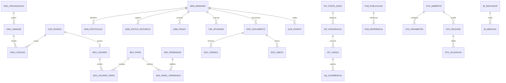

# Modelo de Dados Canônico (CDM) para projetos institucionais

## Metadados

- Versão: v2026.05
- Data: 2026-05-07
- Escopo: modelo lógico reutilizável para projetos administrativos, painéis, portais, sistemas internos, ETL e integrações.
- Origem: consolidado a partir das necessidades do projeto ONASP e das lições do documento `boas_praticas_para_outros_projetos.md`.
- Status: primeira versão canônica.

## Objetivo

Este CDM define um conjunto mínimo e reaproveitável de entidades, campos e regras para que novos projetos comecem organizados, auditáveis e fáceis de retomar. Ele não substitui o modelo físico de cada sistema, mas serve como contrato conceitual para orientar DDL, APIs, ETL, BI, documentação e governança.

## Princípio central

Todo projeto deve separar quatro camadas:

1. **Fonte oficial de dados:** dados externos ou institucionais que devem ser preservados e rastreados.
2. **Estado operacional:** andamento real do trabalho dentro do sistema.
3. **Operação em ambiente real:** execução, parâmetros, integrações, incidentes e releases.
4. **Retomada futura:** documentação, logs, auditoria e decisões necessárias para outra pessoa ou IA continuar.

Quando essas camadas se misturam, surgem regressões, dúvidas de autoria, retrabalho e diagnósticos ruins.

## Convenções de nomenclatura

| Tipo | Padrão | Exemplo |
| --- | --- | --- |
| Tabela canônica | prefixo de domínio + substantivo singular | `DEM_DEMANDA`, `DOC_DOCUMENTO` |
| Chave primária | `<entidade>_ID` | `DEMANDA_ID` |
| Chave estrangeira | nome da entidade referenciada + `_ID` | `UNIDADE_ID` |
| Código externo | `CODIGO_EXTERNO` ou `<sistema>_ID` | `SEI_ID`, `FALABR_PROTOCOLO` |
| Indicador booleano | sufixo `_SN` | `ATIVO_SN`, `SIGILOSO_SN` |
| Datas de negócio | sufixo `_EM` ou `_DATA` | `ABERTO_EM`, `DATA_REFERENCIA` |
| Datas de auditoria | `CRIADO_EM`, `ATUALIZADO_EM`, `EXCLUIDO_EM` | `CRIADO_EM` |
| Usuários de auditoria | `CRIADO_POR`, `ATUALIZADO_POR`, `EXCLUIDO_POR` | `ATUALIZADO_POR` |
| Texto livre | sufixo `_TEXTO` quando longo | `RELATO_TEXTO` |
| Classificação | FK para domínio ou enum controlado | `STATUS_ID`, `TIPO_DEMANDA_ID` |

## Campos canônicos comuns

Use estes campos em entidades operacionais, documentais, de integração e configuração, ajustando quando a tabela for puramente associativa.

| Campo | Obrigatório | Finalidade |
| --- | --- | --- |
| `<ENTIDADE>_ID` | Sim | Identificador interno, preferencialmente surrogate key. |
| `CODIGO` | Quando aplicável | Código humano curto, estável e único no domínio. |
| `NOME` | Quando aplicável | Nome de exibição. |
| `DESCRICAO` | Quando aplicável | Explicação curta. |
| `STATUS_ID` | Quando aplicável | Estado controlado por domínio. |
| `ATIVO_SN` | Sim para cadastros | Indica se o registro está ativo sem apagar histórico. |
| `FONTE_SISTEMA` | Sim em cargas/integrações | Sistema de origem do dado. |
| `CODIGO_EXTERNO` | Sim em dados integrados | Identificador na origem. |
| `CLASSIFICACAO_LGPD` | Sim em dados pessoais | Classificação: pessoal, sensível, anonimizado, público. |
| `NIVEL_SIGILO` | Sim em dados controlados | Público, interno, restrito, sigiloso. |
| `VALIDO_DE` | Quando aplicável | Início de vigência. |
| `VALIDO_ATE` | Quando aplicável | Fim de vigência. |
| `CRIADO_EM` | Sim | Data/hora de criação. |
| `CRIADO_POR` | Sim | Usuário, serviço ou carga responsável. |
| `ATUALIZADO_EM` | Sim | Última atualização. |
| `ATUALIZADO_POR` | Sim | Responsável pela última atualização. |
| `EXCLUIDO_EM` | Quando houver soft delete | Data/hora de exclusão lógica. |
| `EXCLUIDO_POR` | Quando houver soft delete | Responsável pela exclusão lógica. |
| `VERSAO_REGISTRO` | Sim em dados críticos | Controle otimista e rastreio de alteração. |

## Núcleos do CDM

### 1. Núcleo organizacional

| Entidade | Finalidade | Campos principais |
| --- | --- | --- |
| `ORG_ORGANIZACAO` | Órgão, entidade, empresa, instituição ou parceiro. | `ORGANIZACAO_ID`, `NOME`, `SIGLA`, `CNPJ`, `TIPO_ORGANIZACAO_ID`, `ATIVO_SN` |
| `ORG_UNIDADE` | Unidade interna, setor, coordenação, filial ou área responsável. | `UNIDADE_ID`, `ORGANIZACAO_ID`, `UNIDADE_PAI_ID`, `NOME`, `SIGLA`, `CODIGO` |
| `ORG_LOTACAO` | Vínculo temporal de pessoa/usuário com uma unidade. | `LOTACAO_ID`, `PESSOA_ID`, `UNIDADE_ID`, `PAPEL_FUNCIONAL`, `VALIDO_DE`, `VALIDO_ATE` |

### 2. Núcleo de identidade e acesso

| Entidade | Finalidade | Campos principais |
| --- | --- | --- |
| `CAD_PESSOA` | Pessoa física ou representante institucional. | `PESSOA_ID`, `NOME`, `NOME_SOCIAL`, `CPF_HASH`, `EMAIL`, `TELEFONE`, `CLASSIFICACAO_LGPD` |
| `SEG_USUARIO` | Conta de acesso ou identidade técnica. | `USUARIO_ID`, `PESSOA_ID`, `LOGIN`, `EMAIL_INSTITUCIONAL`, `STATUS_ID`, `ULTIMO_ACESSO_EM` |
| `SEG_PAPEL` | Papel de negócio ou perfil de autorização. | `PAPEL_ID`, `CODIGO`, `NOME`, `DESCRICAO`, `ATIVO_SN` |
| `SEG_PERMISSAO` | Permissão granular de sistema. | `PERMISSAO_ID`, `CODIGO`, `NOME`, `ESCOPO`, `ATIVO_SN` |
| `SEG_USUARIO_PAPEL` | Associação temporal entre usuário e papel. | `USUARIO_PAPEL_ID`, `USUARIO_ID`, `PAPEL_ID`, `UNIDADE_ID`, `VALIDO_DE`, `VALIDO_ATE` |
| `SEG_PAPEL_PERMISSAO` | Associação entre papel e permissão. | `PAPEL_PERMISSAO_ID`, `PAPEL_ID`, `PERMISSAO_ID` |

Regras:

- Não use CPF, e-mail ou matrícula como chave primária.
- Armazene CPF como hash ou dado criptografado quando a identificação direta não for necessária.
- Perfis devem ser temporais; o histórico de autorização é parte da auditoria.

### 3. Núcleo de demandas e processos

| Entidade | Finalidade | Campos principais |
| --- | --- | --- |
| `DEM_DEMANDA` | Unidade principal de trabalho: manifestação, chamado, solicitação, processo interno, item de backlog. | `DEMANDA_ID`, `PROTOCOLO`, `TIPO_DEMANDA_ID`, `ASSUNTO_ID`, `STATUS_ID`, `UNIDADE_RESPONSAVEL_ID`, `ABERTO_EM`, `ENCERRADO_EM` |
| `DEM_PROTOCOLO` | Identificadores oficiais associados à demanda. | `PROTOCOLO_ID`, `DEMANDA_ID`, `TIPO_PROTOCOLO_ID`, `CODIGO`, `FONTE_SISTEMA` |
| `DEM_CLASSIFICACAO` | Classificações temáticas, prioridade, risco, sigilo e tags. | `CLASSIFICACAO_ID`, `DEMANDA_ID`, `TIPO_CLASSIFICACAO_ID`, `VALOR_ID`, `OBSERVACAO` |
| `DEM_STATUS_HISTORICO` | Linha do tempo de mudanças de status. | `STATUS_HISTORICO_ID`, `DEMANDA_ID`, `STATUS_ANTERIOR_ID`, `STATUS_NOVO_ID`, `ALTERADO_EM`, `ALTERADO_POR` |
| `DEM_PRAZO` | Controle de prazo legal, SLA ou prazo interno. | `PRAZO_ID`, `DEMANDA_ID`, `TIPO_PRAZO_ID`, `INICIO_EM`, `VENCE_EM`, `CONCLUIDO_EM`, `PRORROGADO_SN` |
| `DEM_RELACIONAMENTO` | Relação entre demandas. | `RELACIONAMENTO_ID`, `DEMANDA_ORIGEM_ID`, `DEMANDA_DESTINO_ID`, `TIPO_RELACIONAMENTO_ID` |

Regras:

- A demanda é o centro operacional; documentos, tarefas, comentários, integrações e métricas apontam para ela quando fizer sentido.
- Status atual pode ficar em `DEM_DEMANDA`, mas toda mudança precisa ir para `DEM_STATUS_HISTORICO`.
- Prazos legais e prazos internos devem ser separados por tipo.

### 4. Núcleo de tarefas, decisões e comunicação

| Entidade | Finalidade | Campos principais |
| --- | --- | --- |
| `TSK_ATIVIDADE` | Tarefa executável vinculada a demanda, projeto ou documento. | `ATIVIDADE_ID`, `DEMANDA_ID`, `TITULO`, `DESCRICAO`, `RESPONSAVEL_ID`, `STATUS_ID`, `VENCE_EM` |
| `TSK_COMENTARIO` | Comentário, despacho interno ou anotação operacional. | `COMENTARIO_ID`, `DEMANDA_ID`, `ATIVIDADE_ID`, `AUTOR_ID`, `COMENTARIO_TEXTO`, `CRIADO_EM` |
| `TSK_DECISAO` | Decisão registrada com justificativa. | `DECISAO_ID`, `DEMANDA_ID`, `DECISOR_ID`, `TIPO_DECISAO_ID`, `FUNDAMENTO_TEXTO`, `DECIDIDO_EM` |
| `TSK_NOTIFICACAO` | Mensagem enviada ou pendente para usuário, unidade ou integração. | `NOTIFICACAO_ID`, `DESTINATARIO`, `CANAL_ID`, `ASSUNTO`, `STATUS_ID`, `ENVIADO_EM` |

Regras:

- Comentário não substitui decisão; decisões exigem campo próprio e fundamento.
- Notificações devem registrar canal, destinatário e resultado para diferenciar erro de código e erro externo.

### 5. Núcleo documental e publicação

| Entidade | Finalidade | Campos principais |
| --- | --- | --- |
| `DOC_DOCUMENTO` | Documento lógico: nota técnica, relatório, despacho, artefato, manual. | `DOCUMENTO_ID`, `TIPO_DOCUMENTO_ID`, `TITULO`, `NUMERO`, `ANO`, `STATUS_ID`, `SIGILOSO_SN` |
| `DOC_VERSAO` | Versão do documento. | `VERSAO_ID`, `DOCUMENTO_ID`, `NUMERO_VERSAO`, `ARQUIVO_ID`, `PUBLICADO_EM`, `VALIDO_DE` |
| `DOC_ANEXO` | Arquivo associado a demanda, documento, publicação ou atividade. | `ANEXO_ID`, `ENTIDADE_TIPO`, `ENTIDADE_ID`, `NOME_ARQUIVO`, `MIME_TYPE`, `HASH_SHA256`, `TAMANHO_BYTES` |
| `PUB_PUBLICACAO` | Item publicado em portal, página, relatório, notícia ou painel. | `PUBLICACAO_ID`, `TITULO`, `URL`, `TIPO_PUBLICACAO_ID`, `STATUS_ID`, `PUBLICADO_EM` |
| `PUB_REFERENCIA` | Referência externa usada como fonte ou inspiração. | `REFERENCIA_ID`, `PUBLICACAO_ID`, `URL`, `TITULO`, `ACESSADO_EM`, `OBSERVACAO` |

Regras:

- Documento lógico e arquivo físico não são a mesma coisa.
- Todo arquivo relevante deve ter hash para integridade.
- Publicações precisam de URL, status e data de publicação ou revisão.

### 6. Núcleo de dados, integrações e qualidade

| Entidade | Finalidade | Campos principais |
| --- | --- | --- |
| `INT_FONTE_DADO` | Sistema, planilha, API, banco ou arquivo de origem. | `FONTE_DADO_ID`, `NOME`, `TIPO_FONTE_ID`, `URL`, `DONO_DADO`, `MODO_ACESSO_ID` |
| `INT_INTEGRACAO` | Contrato de troca de dados. | `INTEGRACAO_ID`, `FONTE_DADO_ID`, `NOME`, `TIPO_INTEGRACAO_ID`, `FREQUENCIA_ID`, `ATIVO_SN` |
| `INT_CARGA` | Execução de importação/exportação/ETL. | `CARGA_ID`, `INTEGRACAO_ID`, `INICIADA_EM`, `FINALIZADA_EM`, `STATUS_ID`, `QTD_LIDA`, `QTD_ERRO` |
| `INT_MAPEAMENTO_CAMPO` | Mapeamento entre campo de origem e campo canônico. | `MAPEAMENTO_ID`, `INTEGRACAO_ID`, `CAMPO_ORIGEM`, `CAMPO_DESTINO`, `REGRA_TRANSFORMACAO` |
| `DQ_OCORRENCIA` | Erro, alerta ou inconsistência de qualidade de dados. | `OCORRENCIA_ID`, `CARGA_ID`, `ENTIDADE_TIPO`, `ENTIDADE_ID`, `SEVERIDADE_ID`, `MENSAGEM` |

Regras:

- A fonte oficial deve permanecer preservada; o sistema operacional cria projeções e estados próprios.
- Toda carga precisa ser reconciliável por contagem, hash, protocolo ou identificador externo.
- Erros de integração devem ser classificados como dado inválido, contrato alterado, indisponibilidade externa ou falha do sistema.

### 7. Núcleo de auditoria, observabilidade e incidentes

| Entidade | Finalidade | Campos principais |
| --- | --- | --- |
| `AUD_EVENTO` | Registro de evento auditável. | `EVENTO_ID`, `ENTIDADE_TIPO`, `ENTIDADE_ID`, `ACAO`, `ANTES_JSON`, `DEPOIS_JSON`, `USUARIO_ID`, `OCORRIDO_EM` |
| `AUD_ACESSO` | Acesso, autenticação, autorização e sessão. | `ACESSO_ID`, `USUARIO_ID`, `IP_ORIGEM`, `USER_AGENT`, `RESULTADO_ID`, `OCORRIDO_EM` |
| `OPS_LOG` | Log operacional padronizado. | `LOG_ID`, `NIVEL_ID`, `COMPONENTE`, `MENSAGEM`, `CORRELATION_ID`, `OCORRIDO_EM` |
| `OPS_INCIDENTE` | Incidente, falha, bloqueio ou indisponibilidade. | `INCIDENTE_ID`, `TITULO`, `SEVERIDADE_ID`, `STATUS_ID`, `ABERTO_EM`, `RESOLVIDO_EM`, `CAUSA_RAIZ` |
| `OPS_RUNBOOK` | Procedimento de operação, partida, parada e recuperação. | `RUNBOOK_ID`, `NOME`, `VERSAO`, `URL_DOCUMENTO`, `VALIDO_DE`, `ATIVO_SN` |

Regras:

- Log explica sintoma; incidente explica causa, impacto e correção.
- Auditoria deve registrar antes/depois para dados críticos.
- Nunca registre senha, token ou segredo em log.

### 8. Núcleo de configuração, ambiente e release

| Entidade | Finalidade | Campos principais |
| --- | --- | --- |
| `CFG_AMBIENTE` | Ambiente real de execução. | `AMBIENTE_ID`, `NOME`, `TIPO_AMBIENTE_ID`, `URL_BASE`, `HOST`, `PORTA`, `ATIVO_SN` |
| `CFG_PARAMETRO` | Parâmetro de aplicação por ambiente. | `PARAMETRO_ID`, `AMBIENTE_ID`, `CHAVE`, `VALOR_MASCARADO`, `SENSIVEL_SN`, `ATIVO_SN` |
| `CFG_FEATURE_FLAG` | Controle de funcionalidade. | `FEATURE_FLAG_ID`, `CODIGO`, `NOME`, `AMBIENTE_ID`, `HABILITADO_SN`, `MOTIVO` |
| `CFG_RELEASE` | Versão entregue, pacote, deploy ou publicação. | `RELEASE_ID`, `VERSAO`, `AMBIENTE_ID`, `STATUS_ID`, `PUBLICADO_EM`, `ROLLBACK_SN` |
| `CFG_VALIDACAO` | Smoke test, checklist ou validação executável. | `VALIDACAO_ID`, `RELEASE_ID`, `TIPO_VALIDACAO_ID`, `STATUS_ID`, `EXECUTADO_EM`, `EVIDENCIA_URL` |

Regras:

- Porta, host e URL fazem parte da operação, não devem ficar escondidos no código.
- Feature flags reduzem risco quando dependência externa ainda não está pronta.
- Toda release deve ter validação mínima e possibilidade de rastrear rollback.

### 9. Núcleo de referência e domínio

| Entidade | Finalidade | Campos principais |
| --- | --- | --- |
| `REF_DOMINIO` | Lista controlada de valores de negócio. | `DOMINIO_ID`, `GRUPO`, `CODIGO`, `NOME`, `ORDEM`, `ATIVO_SN` |
| `REF_LOCALIDADE` | País, UF, município, endereço lógico ou região. | `LOCALIDADE_ID`, `TIPO_LOCALIDADE_ID`, `NOME`, `UF`, `CODIGO_IBGE`, `LOCALIDADE_PAI_ID` |
| `REF_CALENDARIO` | Datas úteis, feriados, competência e calendário de SLA. | `DATA_REFERENCIA`, `ANO`, `MES`, `DIA_UTIL_SN`, `FERIADO_SN`, `DESCRICAO` |

Regras:

- Domínios devem ter código estável e nome de exibição.
- Nunca espalhe listas fixas em múltiplas tabelas sem governança.
- Calendário deve ser dado, não regra escondida no código, quando houver SLA ou prazo legal.

### 10. Núcleo analítico e indicadores

| Entidade | Finalidade | Campos principais |
| --- | --- | --- |
| `BI_INDICADOR` | Definição de KPI, métrica ou indicador. | `INDICADOR_ID`, `CODIGO`, `NOME`, `FORMULA_TEXTO`, `PERIODICIDADE_ID`, `DONO_INDICADOR` |
| `BI_MEDICAO` | Valor medido por período, unidade ou recorte. | `MEDICAO_ID`, `INDICADOR_ID`, `DATA_REFERENCIA`, `UNIDADE_ID`, `VALOR_NUMERICO`, `FONTE_DADO_ID` |
| `BI_PUBLICACAO` | Painel, relatório ou artefato analítico publicado. | `BI_PUBLICACAO_ID`, `TITULO`, `URL`, `FERRAMENTA_ID`, `ATUALIZADO_EM`, `PUBLICO_ALVO_ID` |

Regras:

- Indicador precisa de fórmula, periodicidade, fonte e dono.
- Medição sem fonte não deve entrar em relatório oficial.
- Painéis devem diferenciar dado atualizado, dado congelado e dado estimado.

## Relacionamentos principais

## Regras de governança

### Identidade e privacidade

- Classifique dados pessoais desde o desenho da entidade.
- Use minimização: colete só o necessário para a finalidade.
- Separe identificadores diretos de atributos operacionais quando possível.
- Dados sensíveis exigem controle de acesso, auditoria e justificativa de uso.
- Exportações devem ter escopo, finalidade, responsável e registro de auditoria.

### Auditoria

- Toda entidade crítica deve ter campos de criação e atualização.
- Alterações em status, perfil, prazo, classificação, documento e publicação devem gerar histórico.
- Exclusão física deve ser exceção; prefira exclusão lógica quando houver valor histórico.
- Auditoria deve responder: quem fez, quando fez, o que mudou, por que mudou e qual era o valor anterior.

### Integração e ETL

- Nunca sobrescreva fonte oficial sem trilha de reconciliação.
- Mantenha tabela ou log de carga com contadores de lidos, válidos, rejeitados e atualizados.
- Mapeamentos de campos devem ser documentados e versionados.
- Erros por linha devem preservar valor original, regra violada e severidade.

### Operação

- Registre ambiente, porta, host, URL e forma de partida/parada.
- Mantenha runbook mínimo para operação real.
- Separe erro de aplicação, erro de infraestrutura, erro de rede e erro de provedor externo.
- Funcionalidade dependente de serviço externo deve poder ser desativada por feature flag.

### BI e transparência

- KPI sem fórmula não é KPI; é rótulo.
- Toda métrica pública deve ter fonte, data de atualização e escopo.
- Dados anonimizados para transparência devem ser derivados de processo documentado.
- Painel deve indicar periodicidade de atualização.

## Checklist para novos projetos

Use este checklist antes de gerar DDL ou iniciar desenvolvimento:

- A fonte oficial de dados está separada do estado operacional?
- Existe entidade central de trabalho, como `DEM_DEMANDA` ou equivalente?
- Há histórico para status, prazos e decisões?
- Dados pessoais e sensíveis foram classificados?
- Perfis de acesso são temporais e auditáveis?
- Documentos lógicos estão separados de arquivos físicos?
- Integrações têm fonte, carga, mapeamento e log de qualidade?
- Existe tabela ou estrutura de auditoria para alterações críticas?
- Ambientes, parâmetros e feature flags estão modelados?
- Indicadores possuem fórmula, fonte, periodicidade e responsável?
- Há runbook e validação executável mínima?
- Riscos remanescentes estão registrados?

## Aplicação prática no projeto ONASP

Para a página e os projetos ONASP, o CDM pode ser usado assim:

- `PUB_PUBLICACAO`: página principal, subpáginas, relatório de gestão, painel Power BI e página de referência.
- `DOC_DOCUMENTO`: notas técnicas, despachos, apresentação, banners e relatórios.
- `DOC_ANEXO`: PDFs, PNGs e arquivos de apoio.
- `DEM_DEMANDA`: solicitações à DCOM, pendências editoriais, ajustes de acessibilidade e publicação.
- `TSK_ATIVIDADE`: tarefas de corrigir telefone, inserir QR Code, preencher subpáginas e validar iframes.
- `CFG_VALIDACAO`: smoke test visual do protótipo, checagem de links e verificação mobile.
- `BI_PUBLICACAO`: painel de tratamento de demandas.
- `AUD_EVENTO`: histórico de alterações em páginas, documentos e decisões editoriais.

## Decisões recomendadas para modelos físicos

- Em Oracle, use sequences/identity para chaves surrogate e constraints nomeadas.
- Em PostgreSQL, use `generated always as identity` ou UUID quando houver necessidade distribuída.
- Em SQLite/local, preserve nomes lógicos e simplifique tipos sem perder semântica.
- Em APIs, exponha `id` interno apenas quando necessário; prefira `codigo` ou `protocolo` para o usuário.
- Em BI, crie views de consumo em vez de ligar painel diretamente em tabelas transacionais críticas.

## Antipadrões a evitar

- Usar planilha de origem como banco operacional.
- Tratar status atual como histórico completo.
- Gravar decisão importante apenas em comentário livre.
- Misturar arquivo físico, documento lógico e publicação em uma única tabela.
- Criar perfil permanente sem vigência ou rastreio.
- Publicar métrica sem fórmula e data de atualização.
- Diagnosticar falha externa como erro de código sem evidência.
- Deixar documentação para o fim.

## Fórmula de retomada por IA ou equipe futura

Ao assumir um projeto modelado por este CDM:

1. Leia `PUB_PUBLICACAO`, `DOC_DOCUMENTO` e `OPS_RUNBOOK` para entender o produto.
2. Leia `INT_FONTE_DADO`, `INT_CARGA` e `DQ_OCORRENCIA` para entender a origem dos dados.
3. Leia `DEM_DEMANDA`, `TSK_ATIVIDADE` e `DEM_STATUS_HISTORICO` para entender o estado atual.
4. Leia `AUD_EVENTO`, `OPS_LOG` e `OPS_INCIDENTE` para entender riscos e falhas anteriores.
5. Leia `CFG_AMBIENTE`, `CFG_PARAMETRO` e `CFG_RELEASE` para operar sem depender do editor.
6. Atualize a documentação quando uma causa raiz virar aprendizado reutilizável.
